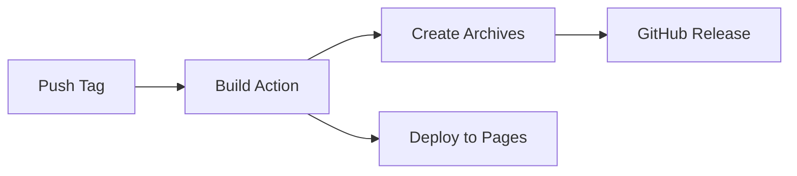

# 🎮 Connecta

<div align="center">


**A modern Discord-like communication platform with premium features**

[Features](#-features) • [Getting Started](#-getting-started) • [Development](#-development) • [Release](#-release) • [Documentation](#-documentation)

</div>

---

## 🌟 Features

### 💎 Premium System
- **Connecta Premium subscription** - $4.99/month or $47.99/year (20% off)
- **12+ Premium Features** including:
  - Custom profile themes and animated avatars
  - HD video & screen share
  - Larger file uploads (100MB)
  - Custom emoji and premium stickers
  - Priority support and early access
  - Enhanced message history
- **Active subscription management** with cancellation support

### 🛒 Store
- **15 Products** across 5 categories:
  - Premium subscriptions
  - Avatar frames ($2.99-$3.99)
  - Themes ($1.99-$2.49)
  - Sticker packs ($0.99-$1.99)
  - Server boosts ($2.99-$6.99)
- **Full checkout flow** with payment method selection
- **Mock payment processing** for testing

### 👤 Profile Customization
- **Premium themes** - 4 free, 3 premium themes with lock system
- **Accent colors** - 2 free, 4 premium colors
- **Avatar frames** - Premium exclusive frames
- **Premium badge** displayed with username
- **Custom banners** with gradient options
- **Profile link sharing** (connecta.link format)

### 💬 Social Features
- **Friends system** with Supabase database
- **Direct messaging** with auto-reply (dev mode)
- **Verification badges** for verified users
- **Link generation** for profiles, servers, calls, friends, groups
- **Server management** with role color customization

### 🐛 Bug Reporting
- **Direct Telegram integration** for instant bug reports
- **Real Telegram bot** connection

### 🎨 Design System
- **GlassCard** components with glassmorphism
- **40+ UI components** from shadcn/ui
- **Dark theme optimized**
- **Responsive design**

---

## 🚀 Getting Started

### Prerequisites
- **Node.js 20+**
- **npm** or **pnpm**
- **Supabase account** (for database features)

### Installation

1. **Clone the repository**
   ```bash
   git clone https://github.com/yourusername/connecta.git
   cd connecta
   ```

2. **Install dependencies**
   ```bash
   npm install
   ```

3. **Configure environment** (create `.env` file)
   ```env
   VITE_SUPABASE_URL=your_supabase_url
   VITE_SUPABASE_ANON_KEY=your_supabase_key
   VITE_DEV_MODE=true
   VITE_TELEGRAM_BOT_TOKEN=your_bot_token
   VITE_TELEGRAM_CHAT_ID=your_chat_id
   ```

4. **Start development server**
   ```bash
   npm run dev
   ```

5. **Open in browser**
   ```
   http://localhost:5173
   ```

---

## 🛠️ Development

### Available Scripts

| Command | Description |
|---------|-------------|
| `npm run dev` | Start development server with HMR |
| `npm run build` | Build for production |
| `npm run supabase:start` | Start local Supabase |
| `npm run supabase:stop` | Stop local Supabase |
| `npm run supabase:status` | Check Supabase status |
| `npm run supabase:reset` | Reset Supabase database |

### Project Structure

```
connecta/
├── .github/
│   └── workflows/          # GitHub Actions workflows
│       ├── build.yml       # Automated builds
│       ├── release.yml     # Release automation
│       └── deploy.yml      # GitHub Pages deployment
├── src/
│   ├── app/
│   │   ├── components/     # React components
│   │   │   ├── design-system/  # Custom components
│   │   │   ├── layout/         # Layout components
│   │   │   └── ui/             # shadcn/ui components
│   │   ├── pages/          # Application pages
│   │   ├── utils/          # Utility functions
│   │   │   ├── payments.ts     # Payment system
│   │   │   ├── telegram.ts     # Telegram integration
│   │   │   ├── linkGenerator.ts # Link generation
│   │   │   └── supabase.ts     # Supabase client
│   │   └── App.tsx
│   ├── lib/                # Shared libraries
│   └── styles/             # CSS styles
├── supabase/               # Supabase configuration
├── guidelines/             # Design guidelines
└── package.json
```

### Tech Stack

- **Frontend**: React 18.3.1 + TypeScript
- **Build Tool**: Vite 6.3.5
- **Styling**: Tailwind CSS 4.1.12
- **Backend**: Supabase
- **UI Components**: shadcn/ui + Radix UI
- **Animations**: Framer Motion
- **Icons**: Lucide React
- **Forms**: React Hook Form
- **Notifications**: Sonner

---

## 📦 Release

### Automated Release Process

Releases are automated via GitHub Actions. To create a new release:

#### Using PowerShell (Windows)

```powershell
.\release.ps1 -Version "1.1.0"
```

#### Using Bash (Linux/Mac)

```bash
chmod +x release.sh
./release.sh 1.1.0
```

#### Manual Release

1. **Update version**
   ```bash
   npm version 1.1.0 --no-git-tag-version
   ```

2. **Update CHANGELOG.md**
   - Add new version section with date
   - List all changes under appropriate categories

3. **Commit and tag**
   ```bash
   git add .
   git commit -m "Release v1.1.0"
   git tag -a v1.1.0 -m "Release version 1.1.0"
   ```

4. **Push to GitHub**
   ```bash
   git push origin main --tags
   ```

5. **GitHub Actions will automatically:**
   - Build the application
   - Create release archives (zip + tar.gz)
   - Create GitHub Release with notes
   - Deploy to GitHub Pages

### Release Workflow



---

## 🌐 Deployment

### GitHub Pages

The application automatically deploys to GitHub Pages on every push to `main` branch.

**Live URL**: `https://yourusername.github.io/connecta/`

### Manual Deployment

1. **Build the application**
   ```bash
   npm run build
   ```

2. **Deploy the `dist` folder** to your web server

3. **Configure base URL** in `vite.config.ts` if needed:
   ```typescript
   export default defineConfig({
     base: '/your-subdirectory/',
   })
   ```

---

## 📚 Documentation

- **[CHANGELOG.md](CHANGELOG.md)** - Version history and changes
- **[Guidelines.md](guidelines/Guidelines.md)** - Design system guidelines
- **[ATTRIBUTIONS.md](ATTRIBUTIONS.md)** - Third-party credits

### Key Files

- **`src/app/utils/payments.ts`** - Payment and purchase system
- **`src/app/utils/telegram.ts`** - Telegram bot integration
- **`src/app/utils/linkGenerator.ts`** - Link generation utilities
- **`src/app/pages/Store.tsx`** - Store implementation
- **`src/app/pages/Subscriptions.tsx`** - Subscription management
- **`src/app/pages/UserProfile.tsx`** - Profile customization

---

## 🔧 Configuration

### Environment Variables

| Variable | Description | Required |
|----------|-------------|----------|
| `VITE_SUPABASE_URL` | Supabase project URL | Yes |
| `VITE_SUPABASE_ANON_KEY` | Supabase anonymous key | Yes |
| `VITE_DEV_MODE` | Enable development features | No |
| `VITE_TELEGRAM_BOT_TOKEN` | Telegram bot token | No |
| `VITE_TELEGRAM_CHAT_ID` | Telegram chat ID for reports | No |

### Supabase Setup

1. **Create tables**
   - `friendships` - Friend relationships
   - `user_2fa` - Two-factor authentication

2. **Enable RLS policies**
   - User-specific data access
   - Secure friend requests

3. **Create RPC functions**
   - `add_friend_request`
   - `accept_friend_request`
   - `remove_friend`

---

## 🤝 Contributing

Contributions are welcome! Please follow these steps:

1. Fork the repository
2. Create a feature branch (`git checkout -b feature/amazing-feature`)
3. Commit your changes (`git commit -m 'Add amazing feature'`)
4. Push to the branch (`git push origin feature/amazing-feature`)
5. Open a Pull Request

---

## 📄 License

This project is licensed under the MIT License.

---

## 🙏 Acknowledgments

- Original Figma design: [Design System for Connecta](https://www.figma.com/design/tX3qDXexFPZLXUQ9uAKdUB/Design-System-for-Connecta)
- UI components: [shadcn/ui](https://ui.shadcn.com/)
- Icons: [Lucide](https://lucide.dev/)

---

<div align="center">

**Made with ❤️ by the Connecta Team**

[Report Bug](https://github.com/yourusername/connecta/issues) • [Request Feature](https://github.com/yourusername/connecta/issues)

</div>
